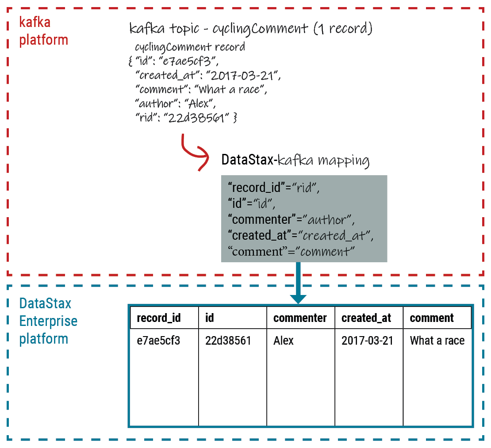

📘 [Documentation](README.md) > Cycling comments example

---

**Quick Links:** [Home](README.md) | [Install](install/README.md) | [Config](config/README.md) | [Operations](operations/README.md) | [Monitoring](monitoring/README.md) | [FAQ](faq.md) | [Troubleshooting](troubleshooting/README.md)

---

# Cycling comments example

The cycling comments example provides a step-by-step implementation for test or demonstration environments that run Apache Kafka, Kafka Connect, and the target database on the same system.

The example maps JSON records from the `CyclingComments` Kafka topic into the `cycling.comments` table.



> [!IMPORTANT]
> This example is intended for local test or demonstration environments. Adjust paths, logging, security settings, and connection properties before using it in shared or production environments.

## What this example demonstrates

- Preparing a local Kafka and connector test environment
- Creating the `CyclingComments` topic
- Creating the `cycling.comments` table
- Configuring the connector to map JSON fields to table columns
- Loading a complete sample dataset into Kafka
- Verifying that Kafka received the records and the connector wrote them to the database

## Before you begin

This example assumes that Apache Kafka, Kafka Connect, and your supported target database are running on `localhost`.

For connector installation and general setup, see the [Installation Guide](install/README.md).

> [!NOTE]
> The legacy tutorial used DataStax Enterprise and local Kafka processes on the same machine. This converted example keeps that same local-development workflow, but the steps also apply to equivalent local environments.

The example uses:

- Kafka topic: `CyclingComments`
- Database table: `cycling.comments`
- Connector configuration file: `cycling-comments-sink.json`
- Example data file: `kafka_examples/data_all.json`

## 1. Set up the local Kafka and connector workspace

Create working directories for Kafka and temporary connector files:

```bash
mkdir kafka && mkdir dseconnectortmp
```

Download and extract Apache Kafka from the [Kafka quickstart](https://kafka.apache.org/quickstart).

Download and extract the connector package from the [GitHub Releases page](https://github.com/datastax/kafka-sink/releases).

Copy the connector JAR into the Kafka plug-in directory:

```bash
mv dseconnectortmp/kafka-connect-cassandra-sink-<version>.jar kafka/libs/
```

Update `kafka/config/connect-distributed.properties` so `plugin.path` points to the directory containing the connector JAR if your worker does not already load plug-ins from `kafka/libs/`.

To simplify the local tutorial setup, create a writable log directory:

```bash
sudo -u root mkdir /var/log/kafka
sudo -u root chmod 777 /var/log/kafka
```

Start ZooKeeper and the Kafka broker with the default configuration:

```bash
kafka/bin/zookeeper-server-start.sh kafka/config/zookeeper.properties > /var/log/kafka/zookeeper_start.log 2>&1 &
kafka/bin/kafka-server-start.sh kafka/config/server.properties > /var/log/kafka/kafka_start.log 2>&1 &
```

Configure the distributed worker to use string converters so the newline-delimited JSON records can be processed as plain strings.

Comment out the default converter settings in `kafka/config/connect-distributed.properties`:

```bash
sed -e '/key\.converter\=/s/^/#/g' -i '' kafka/config/connect-distributed.properties
sed -e '/value\.converter\=/s/^/#/g' -i '' kafka/config/connect-distributed.properties
sed -e '/key\.converter\.schemas\.enable\=/s/^/#/g' -i '' kafka/config/connect-distributed.properties
sed -e '/value\.converter\.schemas\.enable\=/s/^/#/g' -i '' kafka/config/connect-distributed.properties
```

Add the string converter settings:

```bash
echo 'key.converter=org.apache.kafka.connect.storage.StringConverter' >> kafka/config/connect-distributed.properties
echo 'value.converter=org.apache.kafka.connect.storage.StringConverter' >> kafka/config/connect-distributed.properties
echo 'key.converter.schemas.enable=false' >> kafka/config/connect-distributed.properties
echo 'value.converter.schemas.enable=false' >> kafka/config/connect-distributed.properties
```

> [!TIP]
> The `sed -i ''` form shown here matches macOS. On Linux, use `sed -i` instead.

Start the distributed worker:

```bash
kafka/bin/connect-distributed.sh kafka/config/connect-distributed.properties > worker.log 2>&1 &
```

Verify that the worker is running:

```bash
ps auwx | grep ConnectDistributed
```

## 2. Create the Kafka topic

Create the `CyclingComments` topic:

```bash
kafka/bin/kafka-topics.sh --create --bootstrap-server localhost:9092 \
  --replication-factor 1 \
  --partitions 1 \
  --topic CyclingComments
```

> [!TIP]
> The legacy tutorial used `--zookeeper localhost:2181`. For current Kafka releases, `--bootstrap-server localhost:9092` is the preferred syntax.

## 3. Create the keyspace and table

Open `cqlsh`:

```bash
cqlsh
```

Create the `cycling` keyspace:

```sql
CREATE KEYSPACE cycling WITH replication = {'class': 'SimpleStrategy', 'replication_factor': 1};
```

Create the `comments` table:

```sql
CREATE TABLE cycling.comments (
    id UUID,
    created_at TIMESTAMP,
    comment TEXT,
    commenter TEXT,
    record_id TIMEUUID,
    PRIMARY KEY (id, created_at)
) WITH CLUSTERING ORDER BY (created_at DESC);
```

## 4. Create and register the connector

Create the connector configuration file:

```bash
touch kafka/config/cycling-comments-sink.json
```

Add the following configuration to `kafka/config/cycling-comments-sink.json`:

```json
{
  "name": "cycling-comments-sink",
  "config": {
    "connector.class": "com.datastax.kafkaconnector.DseSinkConnector",
    "tasks.max": "1",
    "topics": "CyclingComments",
    "topic.CyclingComments.cycling.comments.mapping": "record_id=value.rid,id=value.id,commenter=value.author,comment=value.comment,created_at=value.created_at"
  }
}
```

Register the connector with the distributed worker:

```bash
curl -X POST -H "Content-Type: application/json" \
  -d @kafka/config/cycling-comments-sink.json \
  http://localhost:8083/connectors
```

Verify connector status:

```bash
curl -X GET "http://127.0.0.1:8083/connectors/cycling-comments-sink/status"
```

## 5. Create the example data file

Create a directory for the example data:

```bash
mkdir kafka_examples
```

Create the sample data file:

```bash
touch kafka_examples/data_all.json
```

Add the following newline-delimited JSON records to `kafka_examples/data_all.json`:

```json
{"id":"e7ae5cf3-d358-4d99-b900-85902fda9bb0","created_at":"2017-04-01 14:33:02.160Z","comment":"LATE RIDERS SHOULD NOT DELAY THE START","author":"Alex","rid":"22d496d1-cf24-11e8-a84b-2b44b2d77e7c"}
{"id":"e7ae5cf3-d358-4d99-b900-85902fda9bb0","created_at":"2017-03-21 21:11:09.999Z","comment":"Second rest stop was out of water","author":"Alex","rid":"22d38561-cf24-11e8-a84b-2b44b2d77e7c"}
{"id":"e7ae5cf3-d358-4d99-b900-85902fda9bb0","created_at":"2017-02-14 20:43:20.234Z","comment":"Raining too hard should have postponed","author":"Alex","rid":"22d225d1-cf24-11e8-a84b-2b44b2d77e7c"}
{"id":"e7ae5cf3-d358-4d99-b900-85902fda9bb0","created_at":"2017-02-14 20:43:20.000Z","comment":"Raining too hard should have postponed","author":"Alex","rid":"22d0c640-cf24-11e8-a84b-2b44b2d77e7c"}
{"id":"c7fceba0-c141-4207-9494-a29f9809de6f","created_at":"2018-10-13 20:11:14.503Z","comment":"The gift certificate for winning was the best","author":"Amy","rid":"22d61d71-cf24-11e8-a84b-2b44b2d77e7c"}
{"id":"c7fceba0-c141-4207-9494-a29f9809de6f","created_at":"2017-04-01 13:43:08.030Z","comment":"Last climb was a killer","author":"Amy","rid":"22da1511-cf24-11e8-a84b-2b44b2d77e7c"}
{"id":"c7fceba0-c141-4207-9494-a29f9809de6f","created_at":"2017-03-22 01:16:59.001Z","comment":"Great snacks at all reststops","author":"Amy","rid":"22d8dc91-cf24-11e8-a84b-2b44b2d77e7c"}
{"id":"c7fceba0-c141-4207-9494-a29f9809de6f","created_at":"2017-02-17 08:43:20.234Z","comment":"Glad you ran the race in the rain","author":"Amy","rid":"22d755f1-cf24-11e8-a84b-2b44b2d77e7c"}
{"id":"8566eb59-07df-43b1-a21b-666a3c08c08a","created_at":"2018-10-13 20:11:14.536Z","comment":"Fastest womens time ever way to go amy!","author":"Maryanne","rid":"22db4d90-cf24-11e8-a84b-2b44b2d77e7c"}
{"id":"8566eb59-07df-43b1-a21b-666a3c08c08a","created_at":"2017-04-14 11:16:52.009Z","comment":"Not bad for a flatlander","author":"Maryanne","rid":"22de81e1-cf24-11e8-a84b-2b44b2d77e7c"}
{"id":"8566eb59-07df-43b1-a21b-666a3c08c08a","created_at":"2017-03-20 21:45:10.101Z","comment":"Saggers really rocked it","author":"Maryanne","rid":"22dd4961-cf24-11e8-a84b-2b44b2d77e7c"}
{"id":"8566eb59-07df-43b1-a21b-666a3c08c08a","created_at":"2017-02-13 17:20:17.020Z","comment":"Great race on a crappy day","author":"Maryanne","rid":"22dc5f01-cf24-11e8-a84b-2b44b2d77e7c"}
{"id":"fb372533-eb95-4bb4-8685-6ef61e994caa","created_at":"2018-10-13 20:11:14.564Z","comment":"Great course","author":"Michael","rid":"22df6c42-cf24-11e8-a84b-2b44b2d77e7c"}
{"id":"fb372533-eb95-4bb4-8685-6ef61e994caa","created_at":"2017-04-07 19:21:14.001Z","comment":"Thanks for waiting for me!","author":"Michael","rid":"22e40021-cf24-11e8-a84b-2b44b2d77e7c"}
{"id":"fb372533-eb95-4bb4-8685-6ef61e994caa","created_at":"2017-03-22 09:19:44.060Z","comment":"Awesome race glad you held it anyway","author":"Michael","rid":"22e2eeb1-cf24-11e8-a84b-2b44b2d77e7c"}
{"id":"fb372533-eb95-4bb4-8685-6ef61e994caa","created_at":"2017-03-17 03:43:01.030Z","comment":"Getting read for the race","author":"Michael","rid":"22e18f21-cf24-11e8-a84b-2b44b2d77e7c"}
{"id":"fb372533-eb95-4bb4-8685-6ef61e994caa","created_at":"2017-02-16 02:22:11.000Z","comment":"Some entries complain a lot","author":"Michael","rid":"22e07db1-cf24-11e8-a84b-2b44b2d77e7c"}
{"id":"9011d3be-d35c-4a8d-83f7-a3c543789ee7","created_at":"2018-10-13 20:11:14.601Z","comment":"Can't wait for the next race","author":"Katarzyna","rid":"22e51192-cf24-11e8-a84b-2b44b2d77e7c"}
{"id":"9011d3be-d35c-4a8d-83f7-a3c543789ee7","created_at":"2017-01-01 17:20:17.020Z","comment":"Gearing up for the seaon","author":"Katarzyna","rid":"22e64a11-cf24-11e8-a84b-2b44b2d77e7c"}
{"id":"5b6962dd-3f90-4c93-8f61-eabfa4a803e2","created_at":"2018-10-13 20:11:14.621Z","comment":"Thanks for all your hard work","author":"Marianne","rid":"22e81ed2-cf24-11e8-a84b-2b44b2d77e7c"}
{"id":"220844bf-4860-49d6-9a4b-6b5d3a79cbfb","created_at":"2018-10-13 20:11:14.627Z","comment":"A for effort!","author":"Paolo","rid":"22e90932-cf24-11e8-a84b-2b44b2d77e7c"}
{"id":"c4b65263-fe58-4846-83e8-f0e1c13d518f","created_at":"2018-10-13 20:11:14.633Z","comment":"Closing ceremony was a little lame","author":"Rossella","rid":"22e9f392-cf24-11e8-a84b-2b44b2d77e7c"}
{"id":"38ab64b6-26cc-4de9-ab28-c257cf011659","created_at":"2018-10-13 20:11:14.641Z","comment":"Next time guys!","author":"Marcia","rid":"22eb2c12-cf24-11e8-a84b-2b44b2d77e7c"}
{"id":"38ab64b6-26cc-4de9-ab28-c257cf011659","created_at":"2017-02-11 14:09:56.000Z","comment":"First race was amazing, can't wait for more","author":"Marcia","rid":"22ec3d81-cf24-11e8-a84b-2b44b2d77e7c"}
{"id":"6ab09bec-e68e-48d9-a5f8-97e6fb4c9b47","created_at":"2018-10-13 20:11:14.655Z","comment":"So many great races thanks y'all","author":"Steven","rid":"22ed4ef2-cf24-11e8-a84b-2b44b2d77e7c"}
{"id":"6ab09bec-e68e-48d9-a5f8-97e6fb4c9b47","created_at":"2017-04-05 12:01:00.003Z","comment":"Bike damaged in transit bummer","author":"Steven","rid":"234ab131-cf24-11e8-a84b-2b44b2d77e7c"}
{"id":"6ab09bec-e68e-48d9-a5f8-97e6fb4c9b47","created_at":"2017-02-02 01:49:00.020Z","comment":"Best of luck everybody I can't make it","author":"Steven","rid":"23499fc1-cf24-11e8-a84b-2b44b2d77e7c"}
{"id":"e7cd5752-bc0d-4157-a80f-7523add8dbcd","created_at":"2018-10-13 20:11:15.273Z","comment":"Go team, you rocked it","author":"Anna","rid":"234bc2a0-cf24-11e8-a84b-2b44b2d77e7c"}
{"id":"6d5f1663-89c0-45fc-8cfd-60a373b01622","created_at":"2018-10-13 20:11:15.280Z","comment":"Next year the tour of california!","author":"Melissa","rid":"234cad02-cf24-11e8-a84b-2b44b2d77e7c"}
{"id":"95addc4c-459e-4ed7-b4b5-472f19a67995","created_at":"2018-10-13 20:11:15.286Z","comment":"Next year for sure!","author":"Vera","rid":"234d9762-cf24-11e8-a84b-2b44b2d77e7c"}
{"id":"95addc4c-459e-4ed7-b4b5-472f19a67995","created_at":"2017-02-13 17:40:16.123Z","comment":"I can do without the rain@@@@","author":"Vera","rid":"25f33bf1-cf24-11e8-a84b-2b44b2d77e7c"}
```

Load the data into Kafka:

```bash
kafka/bin/kafka-console-producer.sh \
  --broker-list localhost:9092 \
  --topic CyclingComments < kafka_examples/data_all.json
```

## 6. Verify the results

Capture all messages from the topic:

```bash
kafka/bin/kafka-console-consumer.sh --bootstrap-server localhost:9092 \
  --topic CyclingComments \
  --from-beginning > ~/CyclingComments-records.log
```

Count the number of records received by Kafka:

```bash
wc -l < ~/CyclingComments-records.log
```

Compare that count to the number of rows written to the database:

```bash
dsbulk count -k cycling -t comments
```

> [!NOTE]
> The topic name is `CyclingComments`, and the mapped destination table is `cycling.comments`. For this sample dataset, the Kafka record count and table row count should match after the connector finishes processing all records.

## Additional resources

- [Installation Guide](install/README.md) - Install and configure the connector
- [Configuration Reference](config/README.md) - Review connector options
- [Connection settings](config/connection.md) - Configure contact points and connectivity
- [Connector details](config/connector.md) - Review connector-specific settings
- [Data Mapping Guide](mapping/README.md) - Learn how to map Kafka topics to database tables
- [FAQ](faq.md) - Frequently asked questions