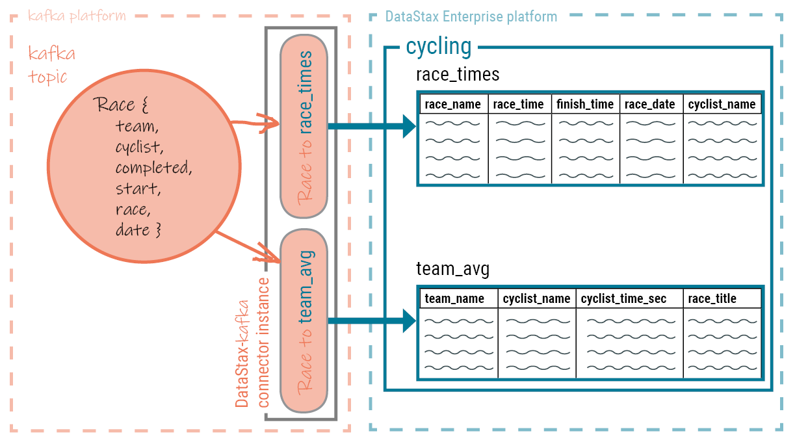

📘 [Documentation](../README.md) > [Introduction](README.md) > How Data is Written

---

**Quick Links:** [Home](../README.md) | [Install](../install/README.md) | [Config](../config/README.md) | [Operations](../operations/README.md) | [Monitoring](../monitoring/README.md) | [FAQ](../faq.md) | [Troubleshooting](../troubleshooting/README.md)

---

# How data is written to the target platform
 
Data from the Kafka topic is written to the mapped platform's database table using a
 batch request containing multiple write statements.
 
The Kafka Connect workers run one or more instances of the DataStax Apache Kafka™ Connector. Each instance of the DataStax Apache Kafka Connector creates a single session with
 the cluster. Data is pulled from the Kafka topic and written to the mapped table using a CQL
 batch that contains multiple write statements. 
 DataStax Apache Kafka Connector can stream records to the following: 
- [DataStax Astra](https://docs.astra.datastax.com/docs) cloud databases
- DataStax Enterprise (DSE) 4.7 and later databases
- Open source Apache Cassandra® 2.1 and later databases
 
The database session is created using the DataStax Java driver. A single connector instance can
 process records from multiple Kafka topics and write to several database tables. 
 
A map specification binds a Kafka topic field to a table column. Fields that are omitted from
 the specification are not included in the write request. Fields with null values are written to
 the database as `UNSET` (see [nullToUnset](../config/table.md#kafkaCassandraTable__nullToUnset)). To
 ensure proper ordering, all records are written using the Kafka record timestamp.
 

 
Use multiple connectors when different global connect settings are required for different
 scenarios, such as writing to different clusters or datacenters.
