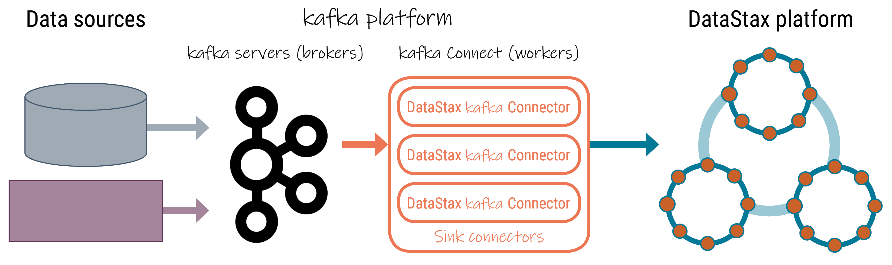

📘 [Documentation](../README.md) > [Introduction](README.md) > Architecture

---

**Quick Links:** [Home](../README.md) | [Install](../install/README.md) | [Config](../config/README.md) | [Operations](../operations/README.md) | [Monitoring](../monitoring/README.md) | [Troubleshooting](../troubleshooting/README.md)

---

# Understanding the architecture
 
Components of a DataStax Apache Kafka Connector implementation.
 
The DataStax Apache Kafka™ Connector is deployed on the Kafka Connect Worker
 nodes and runs within the worker JVM. The Kafka Connect Worker Framework handles automatic
 rebalancing of tasks when new nodes are added and also ships with a built-in REST API for
 operator actions. Running the connector in this framework enables multiple DataStax connector
 instances to share the load and to scale horizontally when run in Distributed Mode. The
 diagram below shows how the DataStax Apache Kafka Connector fits into the Kafka ecosystem. 
 

 The environment is comprised of the following components:
- **Data sources** - Original source of the data, such as databases, applications, and
 other services like Salesforce and Twitter.
- **Kafka platform**
- **Kafka brokers** - Responsible for storing Kafka topics.
- **Kafka connect workers** - The nodes running the Kafka connect framework that
 run producer and consumer plug-ins (Kafka connectors). 
- **Source connectors** - Push messages (data) from the original sources to
 Kafka brokers.
- **Sink connectors** - Workers running one or more instances of the DataStax
 Kafka Connector, which pulls messages from Kafka topics and writes them to a
 database table on the DataStax platform using the DataStax Enteprise Java driver.
- **DataStax platform** - DataStax Apache Kafka Connector synchronizes records from a
 Kafka topic with table rows in the following supported databases:
- [DataStax Astra](https://docs.astra.datastax.com/docs) cloud databases
- DataStax Enterprise (DSE) 4.7 and later databases
- Open source Apache Cassandra® 2.1 and later databases
