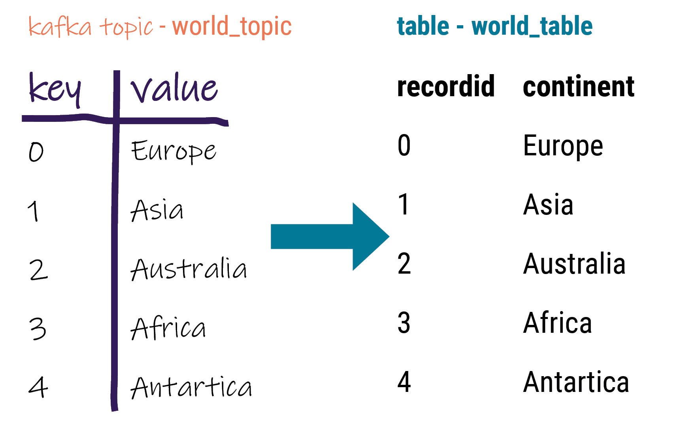

📘 [Documentation](../README.md) > [Data Mapping](README.md) > Key-Value Pairs

---

**Quick Links:** [Home](../README.md) | [Install](../install/README.md) | [Config](../config/README.md) | [Operations](../operations/README.md) | [Monitoring](../monitoring/README.md) | [FAQ](../faq.md) | [Troubleshooting](../troubleshooting/README.md)

---

# Mapping basic messages to table columns
 
Create a topic-table map for Kafka messages that only contain a key and value in each
 record.
 
When messages are created using a Basic or primitive serializer, the message contains a
 key-value pair. Map the key and value to table columns. Ensure that the data types of the
 message field are compatible with the data type of the target column. 
 
For example, the Kafka world topic (`world_topic`) contains 5 records with a
 key-value pair in each. The key is an integer and the value is text.
 



 
Table requirements
 Ensure the following when mapping fields to columns:
- Data in the Kafka field is compatible with the database table column
 data type.
- Kafka field mapped to a database primary key (PK)
 column always contains data. Null values are not allowed in PK
 columns.
 
## Procedure

1. Verify that the correct converter is set in the [key.converter](../config/worker-config.md#key_converter) and [value.converter](../config/worker-config.md#value_converter) of the
 `connect-distributed.properties` file.
2. Set up the [supported database](../README.md#kafkaIntro__kafkaIntroduction) table. 
1. Create the keyspace. Ensure
 that keyspace is replicated to a datacenter that is set in the
 DataStax Apache Kafka Connector [contactPoints](../config/connection.md#kafkaDseConnection__contactPoints)
 parameter. For example, create the
 world_keyspace:
```bash
cqlsh -e "CREATE KEYSPACE world_keyspace WITH replication = {'class': 'NetworkTopologyStrategy','Cassandra': 1};"
```

> **Note:** Note: The datacenter name is case sensitive. Use nodetool ring to get a list of
 datacenters.
2. Create the table. For example, create the
 world_table:
```bash
cqlsh -e "CREATE TABLE world_table (recordid int PRIMARY KEY, continent text);"
```
3. Verify that all nodes have the same schema version using nodetool describering. Replace
 keyspace_name:
```bash
nodetool describering -- keyspace_name
```
3. In the DataStax Apache Kafka Connector configuration file: 
1. Add the topic name to [topics](../config/table.md#kafkaCassandraTable__topics).
2. Define the topic-to-table map [prefix](../config/table.md#kafkaCassandraTable__prefix).
3. Define the [field-to-column
 map](configuration_reference/kafkaDseTable.md#kafkaCassandraTable__mapping).
 Example configurations for `world_topic` to
 `world_table` using the minimum required settings: 
> **Note:** Note: See [DataStax Apache Kafka Connector configuration parameter reference](../monitoring/README.md) for additional
 parameters. When the [contactPoints](../config/connection.md#kafkaDseConnection__contactPoints) parameter is
 missing, the `localhost`; this assumes the database is co-located on
 the DataStax Apache Kafka Connector node.

- JSON for distributed
 mode:
```json
{
 "name": "world-sink",
 "config": {
 "connector.class": "com.datastax.kafkaconnector.DseSinkConnector",
 "tasks.max": "1",
 "topics": "world_topic",
 "topic.world_topic.world_keyspace.world_table.mapping”: “recordid=key, continent=value"
 }
}
```
- Properties file for standalone
 mode:
```
name=world-sink
connector.class=com.datastax.kafkaconnector.DseSinkConnector
tasks.max=1
topics=world_topic
topic.world_topic.world_keyspace.world_table.mapping = recordid=key, continent=value
```
4. [Update configuration on a running
 worker](operations/kafkaUpdateConfig.md) or [deploy the DataStax Connector
 for the first time](operations/kafkaStartStop.md).
