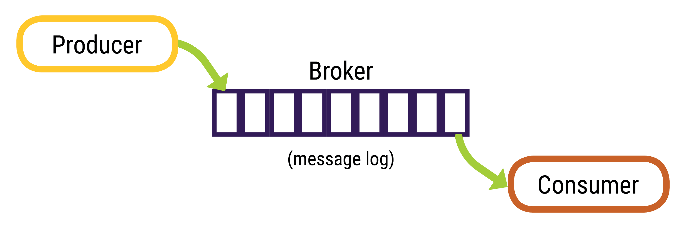
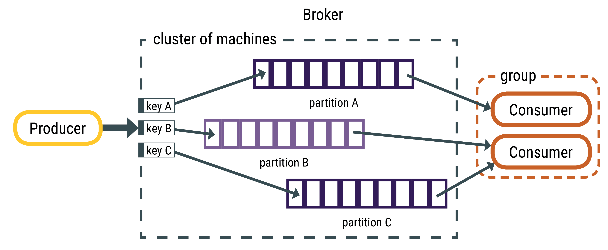

📘 [Documentation](../README.md) > [Data Mapping](README.md) > Message Processing

---

**Quick Links:** [Home](../README.md) | [Install](../install/README.md) | [Config](../config/README.md) | [Operations](../operations/README.md) | [Monitoring](../monitoring/README.md) | [Troubleshooting](../troubleshooting/README.md)

---

# How Apache Kafka messages are written
 
Overview of the Apache Kafka™ topic data pipeline.
 Apache Kafka™ is a distributed streaming message queue. Producers publish
 messages to a topic, the broker stores them in the order received, and consumers (DataStax
 Connector) subscribe and read messages from the topic. 

 
Messages (records) are stored as serialized bytes; the consumers are responsible for
 de-serializing the message. Messages can have any format, the most common are string, JSON,
 and Avro. 
 
The messages always have a key-value structure; a key or value can be null. If the producer
 does not indicate where to write the data, the broker uses the key to partition and replicate
 messages. When the key is null, messages are distributed using the round-robin distribution.
 The DataStax Connector reads messages using tasks; each task subscribes to a subset of
 partitions. Therefore, all messages on the same partition are pulled by the same task. 

 
Topic partitions contain an ordered set of messages and each message in the partition has a
 unique offset. Kafka does not track which messages were read by a task or consumer. Consumers
 must track their own location within each log; the Datastax Connector task store the offsets
 in `config.offset.topic`. In the event of a failure, the DataStax Connector
 task resumes reading from the last recorded location. By default, Kafka retains messages for
 seven days. The retention setting is configured per topic.
