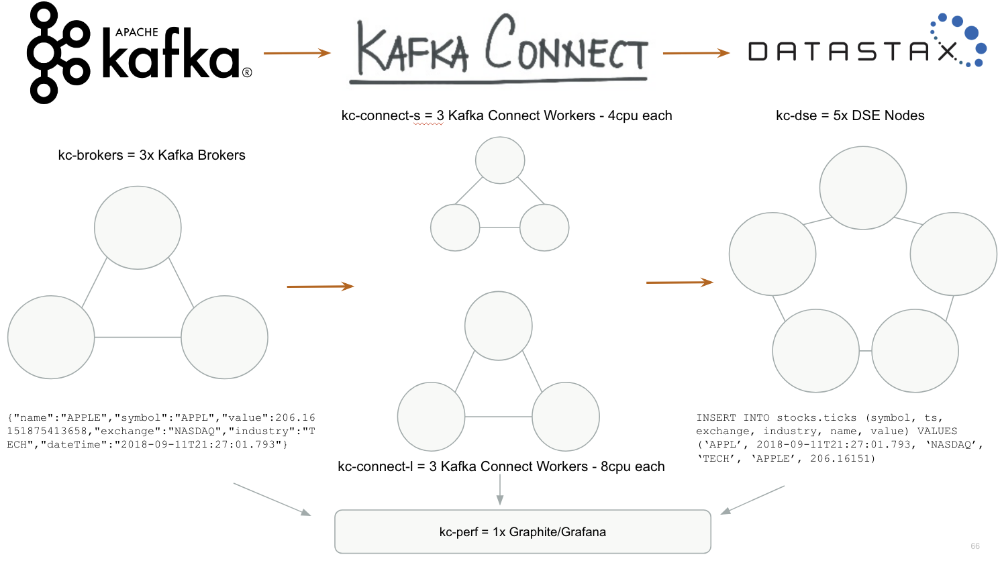

## Setup Performance Testing Environment

Before you will start any performance/endurance tests configure CTOOL_ENV and CONNECTOR_JAR_LOCATION 
variables in the setupPerfEnv.sh script.
- CONNECTOR_JAR_LOCATION set it to the exact location of connector JAR on your local machine.
- CTOOL_ENV set it to the python virtual environment in which you have the setup of ctool.

This script is executed by every startEndurance* and startAvro* script. You don't need to start it directly.

## Environment

The setup script will create: 
- 3 Kafka Brokers (m3.2xlarge): they have Kafka, Zookeeper and Schema-Registry services running
- 3 Kafka Connect (c3.2xlarge): they have Distributed Connect Workers running
- 5 DSE nodes (m3.2xlarge): they have DSE running

## JSON Performance Testing

To start JSON Performance Testing use ./startPerfJson.sh
This script will spin up the whole testing environment.
When the environment will be ready it will produce 1_000_000_000 records to the json-stream topic - that operation will be blocking.
Once the all records will be sent successfully to Kafka it will submit new connect connector that will save all data into DSE.
You need to monitor the status of saving. You can do it by accessing graphite. To open Grafana run ./openGrafana.sh.

Once the connector will insert 1_000_000_000 records you should verify that those records were saved successfully into DSE
by using ./verifyJsonDseTable.sh

After the successful test, you should destroy the whole cluster by using ./destroyCluster.sh

## Avro Performance Testing

To start AVRO Performance Testing use ./startPerfAvro.sh
This script will spin up the whole testing environment.
When the environment will be ready it will produce 200_000_000 records to the avro-stream topic - that operation will be blocking.
Once the all records will be sent successfully to Kafka it will submit new connect connector that will save all data into DSE.
You need to monitor the status of saving. You can do it by accessing graphite. To open Grafana run ./openGrafana.sh.

Once the connector will insert 200_000_000 records you should verify that those records were saved successfully into DSE
by using ./verifyAvroDseTable.sh

After the successful test, you should destroy the whole cluster by using ./destroyCluster.sh

## JSON Endurance Testing

To start JSON Endurance Testing use ./startEnduranceJson.sh
This script will spin up the whole testing environment.
When the environment will be ready it will produce 20_000 records per second to the json-stream topic - that operation is non-blocking.
It means that the producer will be working infinitely until there will be no space on the kafka-brokers.
Next, the connector will be submitted and it will be running constantly picking new events from Kafka and saving them to DSE.

After the successful test, you should destroy the whole cluster by using ./destroyCluster.sh

## AVRO Endurance Testing

To start AVRO Endurance Testing use ./startEnduranceAvro.sh
This script will spin up the whole testing environment.
When the environment will be ready it will produce 5000 records per second to the avro-stream topic - that operation is non-blocking.
It means that the producer will be working infinitely until there will be no space on the kafka-brokers.
Next, the connector will be submitted and it will be running constantly picking new events from Kafka and saving them to DSE.

After the successful test, you should destroy the whole cluster by using ./destroyCluster.sh
